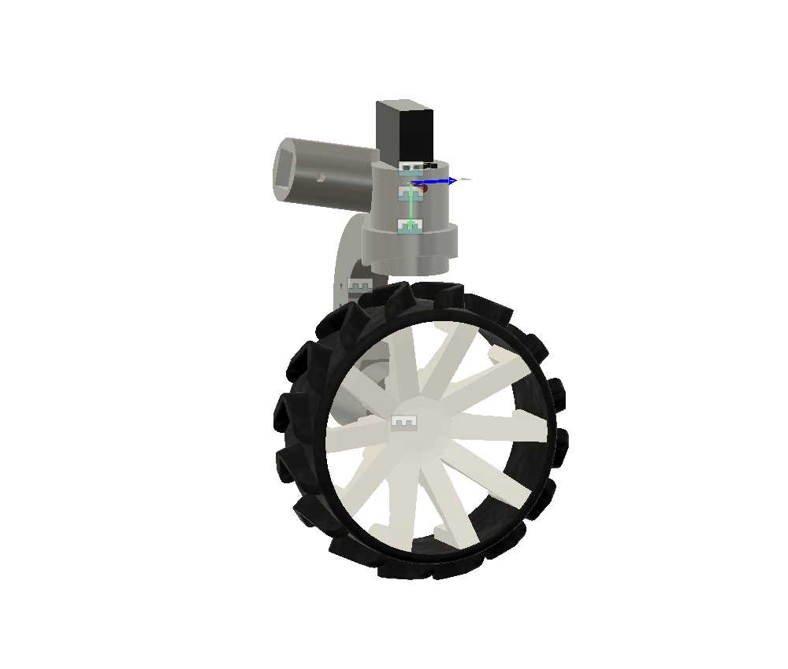
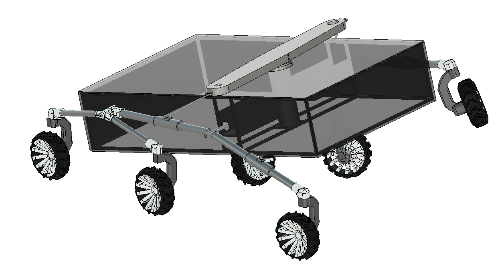
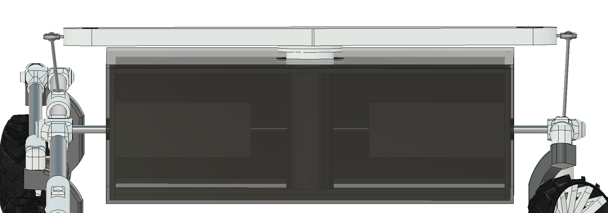

# ROVER "Target Fidelity"

A low-budget, 6-wheel autonomous rover that drives itself through rough terrain, collects soil and plant samples, and runs onboard biology and geology tests — all built from 3D-printed parts, off-the-shelf motors, and open-source software. Or so I hope.

## The demo

**[coming soon]**

---

## What it does

- **Drives itself** — autonomous navigation with SLAM mapping and AR marker detection
- **Handles rough terrain** — rocker-bogie passive suspension (inspired by JPL's open-source rover) keeps all 6 wheels on the ground on dirt, gravel, and grass
- **Real differential** — a balancín + bieletas linkage (like the actual JPL rover) keeps the chassis level when the two sides climb at different heights
- **Collects samples** — a 3-DOF robotic arm with a soil scoop and sealed sample container, controlled by inverse kinematics
- **Runs field biology** — automated Biuret protein test (CuSO₄ + NaOH mix) and plant pigment detection, read by an onboard RGB color sensor
- **Measures soil moisture** — capacitive sensor for real-time geology data
- **Can be driven remotely** — full teleop mode with live camera feed over local WiFi

---

## Key specs

| Spec | Value |
|---|---|
| Chassis body | 900 × 600 mm |
| Wheelbase | 1000 mm |
| Wheel diameter | 200 mm |
| Top speed | ~150 mm/s |
| Obstacle clearance | 300 mm (1.5× wheel Ø) |
| Ground clearance | ~248 mm |
| Estimated mass | ~30 kg |
| Suspension | Passive rocker-bogie, 6 wheels |
| Differential | Real (balancín + bieletas, chassis-leveling) |
| Steering | 4 corner wheels (servo) |

---

## Subsystems

| Subsystem | Key components |
|---|---|
| Chassis | Aluminum 2020 extrusion + PLA/PETG 3D-printed joints |
| Mobility | 6× JGB37 DC motors, BTS7960 drivers, TPU wheels, 2× 448 CPR optical encoders |
| Differential | Balancín + 2 bieletas with ball-joint ends |
| Steering | 4× MG995R servos + PCA9685, printed-bearing knuckle (see below) |
| Brain | Arduino UNO Q (Linux Cortex-A53 + realtime Cortex-M33, one board) |
| Vision | WIP |
| Navigation | WIP |
| Sampling arm | 4× SG51R mini servos, WIP structure |
| Lab | TCS34725 color sensor, peristaltic pump, syringe dispenser |
| Geology | Capacitive soil moisture sensor |

---

## Wheel-corner assembly

Each steering wheel (front-left/right, rear-left/right) is a servo, a printed knuckle, a coupler, and the wheel itself, all validated as a standalone assembly (`Ensamble llanta` / `Ensamble llanta Largo`) before going into the full rover.

- **Geometry adapted from a proven reference** — the servo coupler, servo horn, and wheel-joint pieces come from the "Mars Rover Perseverance Replica" build rather than being designed from scratch. The 37 mm gearmotor (6 mm D-shaft, 31 mm bolt circle) drops straight into the reference's wheel-joint cavity with no scaling.
- **Printed bearing, not a bought one** — the knuckle carries a print-in-place ball bearing (OpenSCAD + BOSL2, "635" size: ID5/OD19/W6mm, dumbbell rollers) instead of a purchased bearing.
- **Socket angle comes from the live model** — the socket tilts so the servo's steering axis is exactly vertical despite sitting on an angled rocker/bogie arm: **30°** at the front/rocker corner, **10°** at the rear/bogie corner, both measured from the actual Fusion assembly rather than assumed.
- **Mirrored for both sides** — all three knuckle variants (`JuntaLlanta`, `JuntaLlantaEstatica`, `JuntaLlantaDireccion`) have mirrored left-side counterparts (`...I` suffix) so the 6-wheel layout is symmetric.

*The steering knuckle (servo + printed bearing + wheel) swinging through its range in Fusion — see [Wheel-corner assembly](#wheel-corner-assembly) below. Full field-test GIF still coming.*

---

## Bill of Materials

The full, current BOM (every subsystem, quantities, real prices, and status) lives in [`BOM/bom_rover.csv`](BOM/bom_rover.csv) — that CSV is the source of truth, this section is just the highlights.

**Cotizado** (priced out in a real quote — [Cotización S174842](https://www.didacticaselectronicas.com), I+D Didácticas Electrónicas, COP $2,216,852 with IVA — nothing purchased yet): all 6 JGB37 motors + 3 BTS7960 drivers + steering/arm servos + PCA9685, 13 m of 2020 aluminum profile + T-nuts, PETG/TPU filament, the Arduino UNO Q brain, 2× 448 CPR optical encoders, plus assorted cabling and small hardware.

**Pendiente** (not priced/sourced yet): round aluminum tube + steel axle for the differential, the acrylic/MDF lid, the LiPo battery + charger, and the lab-module hardware (color sensor, pumps, syringe dispenser).

---

## Printed parts — quick guide

### A couple of things worth knowing before printing

- **The joints set all the angles**, so the aluminum tubes are cut straight at 90°. No mitering needed — that's the whole point of the printed joints.
- **All three wheel mounts share the same 90 mm drop** (socket to wheel center). That's what keeps the three wheels level on the ground — don't change it on just one.
- **The differential bieletas need ball joints on both ends** — a rigid connection binds the linkage. The 1:1 ratio (balancín arm = clamp offset = 180 mm) is what keeps the leveling symmetric.
- **Joint walls are 5 mm** — don't go thinner or the M5 bolts pull out of the PETG under load.

Print-ready STL files for every finished functional part live in [`Parts/STL-parts`](Parts/STL-parts), organized by subsystem (`Bogie`, `Direccion`, `Llantas`) rather than by print settings — CAD source stays in Fusion, this folder is just the slicer-ready output.

---

## Build journal

The full design log — why rocker-bogie, the math behind the geometry, dead ends, and every decision along the way — is in [`Journal/Librito_Rover x_x (CreacionSistemaMecanico) .pptx`](<Journal/Librito_Rover x_x (CreacionSistemaMecanico) .pptx>). It's a running notebook, not a polished report; open it in PowerPoint/Slides to read or add to it.

---

## Credits

- Suspension design heavily inspired by [NASA JPL Open Source Rover](https://github.com/nasa-jpl/open-source-rover) 

